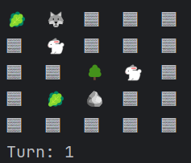

# Проект “Симуляция” 
___
Суть проекта - пошаговая симуляция 2D мира, населённого травоядными и хищниками. Кроме существ, мир содержит ресурсы (траву), которыми питаются травоядные, и статичные объекты, с которыми нельзя взаимодействовать - они просто занимают место.  

***Контроль над игрой:***
- клавиша p - постановка и снятие с паузы;
- клавиша q - авершение симуляциии.

___
